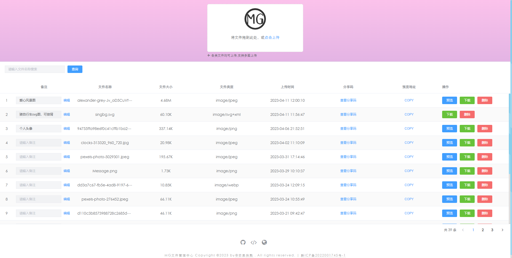
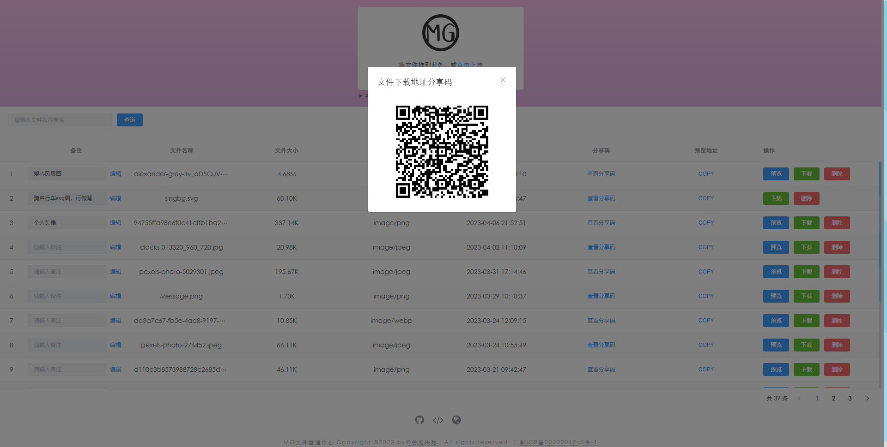

# 个人文件管理+图床管理服务系统

#### 项目介绍

---
🎉开源轻量级个人文件管理、图床管理服务系统，对文本文件、图片、视频、音频、音乐等各类文件的存储管理支持多图上传等功能，基于node.js、mysql、vue2实现。内置用户登录和其他相关接口可扩展功能

[🌍在线预览demo：http://files.zhouyi.run/#/](http://files.zhouyi.run/#/)

#### 项目截图

---



#### 安装教程

---
1.  clone代码
    
`git clone https://gitee.com/Z568_568/zy.files.sys.git`

2.  client安装启动

```js
cd client
npm i
npm run serve
```

3.  server安装启动
 - 新建数据库 `mg_open`
 - 找到 `server/sql/mg_open.sql` 并且运行sql文件
 - 找到 `server/config/index.js` 配置数据库
```js
cd server
npm i
nodemon app
```
4. 测试功能

 - 上传文件后会在 server 端  `server/uploads_files/files` 中查看该文件

#### 关于作者

---
创建和维护由
- [@ZY_GITEE](https://gitee.com/Z568_568)
- [@ZY_GITHUB](https://github.com/ZHYI-source)
- 想咨询其他或合作请发我邮箱1840354092@qq.com
- 到我主页留言 [http://www.zhouyi.run](http://www.zhouyi.run/#/About)
- 我的博客站点 [http://blog.zhouyi.run](http://blog.zhouyi.run/#/)

#### 感谢作者
如果该项目对你有帮助的话 可以通过扫下面二维码打赏来感谢我的努力和花费的时间来创建这个有用的项目。

<div>
    
    
</div>
